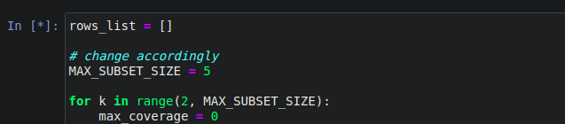

# NIST-coverage
- Dataset of result logs obtained from application of [NIST SP 800-22 Revision 1a Randomness Test Suite](https://csrc.nist.gov/publications/detail/sp/800-22/rev-1a/final) on 2 RNGs - /dev/urandom (tRNG) and [ID Quantique Quantis 4M](https://www.idquantique.com/random-number-generation/products/quantis-random-number-generator/) (qRNG).
- Coverage study of 15 tests of randomness defined in the NIST battery. See [1].

## Dependencies
- os
- numpy
- pandas

## The Dataset
The directory structure is as follows: 

The respective **logs** directories contain 188 text files each, for the 188 p-values obtained from the 15 tests in the NIST battery. Each text file is 100,000 lines for 100,000 bitstreams.

## Usage
- First, execute **run.sh** in a directory containing your random binary file **data.bin** of minimum size 12.5GB.
    - runs 15 parallel instances of NIST for the 15 testes of randomness, and
    - collects 188 result logs (for 188 p-values generated) in a new subdirectory **logs**
- Then execute **post-processing.ipynb** in the same directory.
    - generates **fail_fail_ratio.csv**, **marginal_benefits.csv** and **most_efficient_subsuites.json** (not included in the archive)
    - **fail_fail_ratio.csv** corresponds to **Table 5** in the paper (see [1])
    - **marginal_benefits.csv** corresponds to **Table 10** in the paper (see [1])
    - **most_efficient_subsuites.json** corresponds to **Table 7** in the paper (see [1])

## Important Note
While some tests produce multiple p-values, one test in particular - **NonOverlappingTemplate** - produced 148 p-values! This has brought the total number of tests (p-values) to 188. Since coverage needs to be calculated for all subsets of size k=2, 3, ... this test has made the computation extremely large since all subsets of k tests have to be evaluated for k = 2, 3, ...

Since **NonOverlappingTemplate** test has in a way "polluted" the dataset, evaluating most efficient subsuites for k=4 onwards will take a very very long time. But here's a sample of what is generated from **post-processing.ipynb**.

You can choose the maximum size of the subsets to be evaluated by changing **MAX_SUBSET_SIZE** in the penultimate cell in the jupyter notebook.

I think **NonOverlappingTemplate** should be skipped in our study which would bring down the number of tests (p-values) to 188 - 148 = 40, which can be computed much more comfortably. It was also the **second last test to finish (last being LinearComplexity Test** which produces a single p-value).

Another test, **RandomExcursionsVariant** produced 18 p-values, but was the 8th test to finish (out of 15) which isn't so shabby.

## References:
1. Sulak, Fatih, et al. **"On the independence of statistical randomness tests included in the NIST test suite."** Turkish Journal of Electrical Engineering & Computer Sciences 25.5 (2017): 3673-3683.